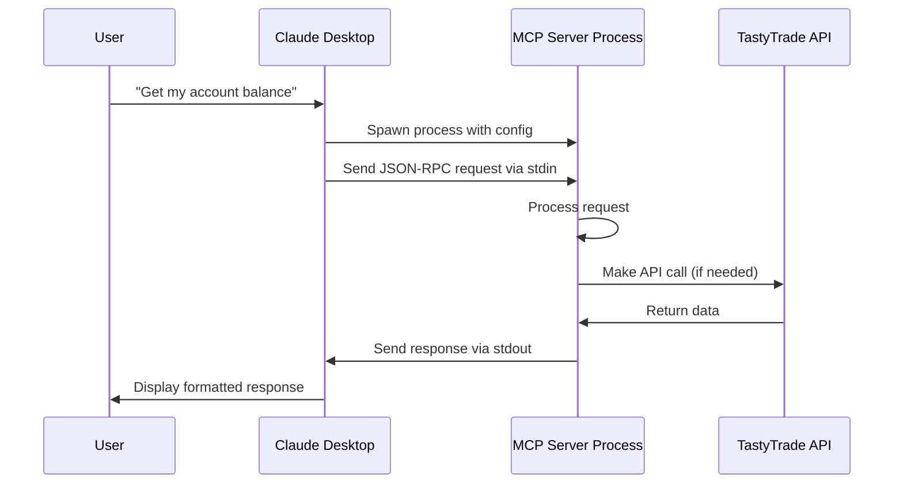

# Claude Desktop + TastyTrade MCP Server Setup Guide

## How It Works

Claude Desktop (the app on your Mac) can connect to MCP servers running locally on the same machine. When configured, Claude Desktop will:

1. **Start your MCP server automatically** when you launch Claude Desktop
2. **Communicate via stdio** (standard input/output) - no network required
3. **Keep the server running** while Claude Desktop is open
4. **Stop the server** when Claude Desktop closes

## Setup Instructions

### Step 1: Locate Claude Desktop Configuration

Claude Desktop stores its configuration in:
```
~/Library/Application Support/Claude/claude_desktop_config.json
```

### Step 2: Edit the Configuration

Open Terminal and edit the config file:

```bash
# Open in your default editor
open ~/Library/Application\ Support/Claude/claude_desktop_config.json

# Or use nano/vim
nano ~/Library/Application\ Support/Claude/claude_desktop_config.json
```

### Step 3: Add TastyTrade MCP Server

Add or merge this configuration into your `claude_desktop_config.json`:

```json
{
  "mcpServers": {
    "tastytrade": {
      "command": "/Volumes/Working_6/Tasty_MCP/.venv/bin/python",
      "args": [
        "/Volumes/Working_6/Tasty_MCP/src/tastytrade_mcp/main.py"
      ],
      "env": {
        "PYTHONPATH": "/Volumes/Working_6/Tasty_MCP/src",
        "TASTYTRADE_USE_SANDBOX": "true"
      }
    }
  }
}
```

**Important**: If you already have other MCP servers configured, add the "tastytrade" section to the existing "mcpServers" object:

```json
{
  "mcpServers": {
    "filesystem": {
      // ... existing filesystem server config
    },
    "tastytrade": {
      "command": "/Volumes/Working_6/Tasty_MCP/.venv/bin/python",
      "args": [
        "/Volumes/Working_6/Tasty_MCP/src/tastytrade_mcp/main.py"
      ],
      "env": {
        "PYTHONPATH": "/Volumes/Working_6/Tasty_MCP/src",
        "TASTYTRADE_USE_SANDBOX": "true"
      }
    }
  }
}
```

### Step 4: Restart Claude Desktop

1. **Quit Claude Desktop completely** (Cmd+Q or Claude → Quit Claude)
2. **Relaunch Claude Desktop**

### Step 5: Verify Connection

In Claude Desktop, you can verify the MCP server is connected:

1. Start a new conversation
2. Type: "What MCP tools do you have available?"
3. Claude should list the TastyTrade tools if connected

Or test directly:
```
Can you check the health of the TastyTrade MCP server?
```

## How the Communication Works



## Troubleshooting

### 1. Server doesn't appear to be connected

Check if the server starts manually:
```bash
/Volumes/Working_6/Tasty_MCP/.venv/bin/python \
  /Volumes/Working_6/Tasty_MCP/src/tastytrade_mcp/main.py
```

You should see:
```
INFO:tastytrade-mcp:Starting TastyTrade MCP Server v0.1.0 in development mode
```

Then it will wait for input (press Ctrl+C to exit).

### 2. Permission issues

Make sure the Python script is executable:
```bash
chmod +x /Volumes/Working_6/Tasty_MCP/src/tastytrade_mcp/main.py
```

### 3. Path issues

Verify all paths exist:
```bash
# Check virtual environment Python
ls -la /Volumes/Working_6/Tasty_MCP/.venv/bin/python

# Check main script
ls -la /Volumes/Working_6/Tasty_MCP/src/tastytrade_mcp/main.py

# Check environment file
ls -la /Volumes/Working_6/Tasty_MCP/.env
```

### 4. View Claude Desktop logs

To see if there are connection errors:
```bash
# Claude Desktop logs location (may vary)
tail -f ~/Library/Logs/Claude/console.log
```

### 5. Test with a simple MCP request

Once connected, ask Claude:
```
Using the TastyTrade MCP tools, can you:
1. Run a health check
2. List available tools
```

## Alternative: Run Server Separately (for debugging)

For debugging, you can run the server manually and see its output:

**Terminal 1 - Start the server:**
```bash
cd /Volumes/Working_6/Tasty_MCP
source .venv/bin/activate
python src/tastytrade_mcp/main.py
```

**Terminal 2 - Test with curl (example):**
```bash
# This won't work directly as MCP uses stdio, but shows the concept
echo '{"jsonrpc":"2.0","method":"tools/list","id":1}' | \
  /Volumes/Working_6/Tasty_MCP/.venv/bin/python \
  /Volumes/Working_6/Tasty_MCP/src/tastytrade_mcp/main.py
```

## Security Notes

1. **The server runs locally** - No network exposure
2. **Communication is via stdio** - Not accessible from outside
3. **Sandbox mode by default** - Safe for testing
4. **Credentials in .env** - Keep your .env file secure

## What You Can Do Once Connected

Once the MCP server is connected to Claude Desktop, you can:

```
"Show me my TastyTrade accounts"
"Get current positions for account [number]"
"What's the current price of AAPL?"
"Create a buy order for 10 shares of MSFT"
"Analyze a bull call spread on SPY"
"Show me the options chain for TSLA"
"Get my account balance"
"List my recent orders"
```

All these commands will be processed through the MCP tools without you having to manage the connection manually.

## Summary

1. **Claude Desktop is a local app** on your Mac
2. **MCP servers also run locally** on your Mac
3. **Connection is via subprocess** - Claude starts your Python server
4. **Communication is via stdio** - JSON-RPC messages through stdin/stdout
5. **No internet/network needed** for the MCP connection itself (though the TastyTrade API calls do need internet)

The key insight: Claude Desktop acts as a "launcher" for your MCP server, starting it as a child process and talking to it directly through pipes, not through any network connection.